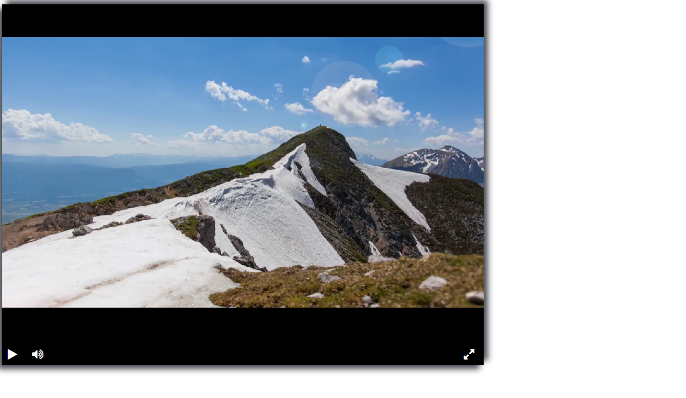

# Lesson1-Layout-video-player

## Как запустить

Проект создаёт видеоплейер в браузере. Чтоб открыть плеер напишите в чат команду:
```
livereload player_code
```
После в консоли появится ссылка. Она будет выглядить примерно так: `http://127.0.0.1`, вам нужно будет перейти по ней. После прехода вы увидите вот такой сайт:

А вот и демо [страница](https://limonhog.github.io/Lesson1-Layout-video-player/player_code/index)

Чтобы понять, как происходит подключение функций к необходимым кнопкам, прочтите эту [документацию](https://github.com/devmanorg/video-player-jslib). 

Иконки взяты с сайта [Font Awesome](https://fontawesome.com/v4).

## Цель проекта

Код написан в образовательных целях на онлайн-курсе для веб-разработчиков [dvmn.org](https://dvmn.org/).